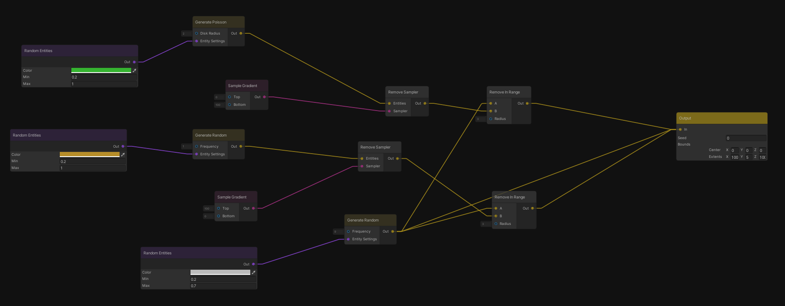

## Entity Graph

A system for generating entity point cloud maps for use in game production.  
The entities can be mapped to assets such as trees, rocks, grass and placed onto terrain.  
The system was originally designed with distributing objects for terrain biomes in mind, but it is general-purpose enough to be used elsewhere.
The system uses a graph editor to define rules and get the desired resulting point cloud.  

Example nodes include:  
*Generators* such as Poisson-Disk distribution.  
*Samplers* for noise, worldspace position, etc for randomising inputs.  
*Entity samplers* that provide details for specific entity types such as color, size, or assosiated assets. 
*Operators* for modifying, adding, removing entities or other values, etc.

NOTE: This project is in very early stages and not recommended for use in production. Using it without reasonably strong programming knowledge may be a challenge and things are likely to break.

### Prerequisites

* Unity 2020.2
* Node Graph Processor 1.01

### Installation

1. Install the NodeGraphProcessor package from this repo
2. Copy Assets/EntityGraph into your project.
3. Figure out how to use it without any documentation. Or come back later once the project is more mature ¯\\\_(ツ)_/¯

## Roadmap

See the [Trello Board](https://trello.com/b/e9z9f0YN/entity-graph) for my current plans.

## Contributing

If this project is useful to you. Any contributions you make are **greatly appreciated**.

1. Fork the Project
2. Create your Feature Branch (`git checkout -b feature/AmazingFeature`)
3. Commit your Changes (`git commit -m 'Add some AmazingFeature'`)
4. Push to the Branch (`git push origin feature/AmazingFeature`)
5. Open a Pull Request

## License

Distributed under the MIT License. See `LICENSE` for more information.